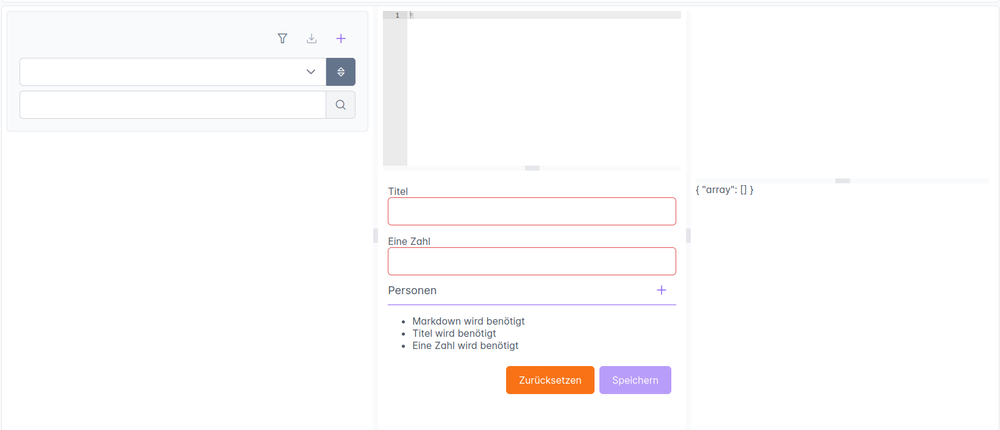
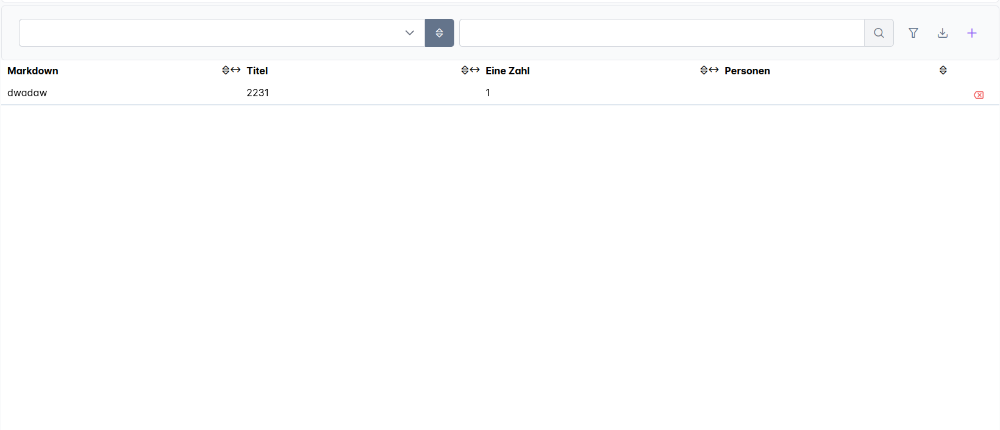
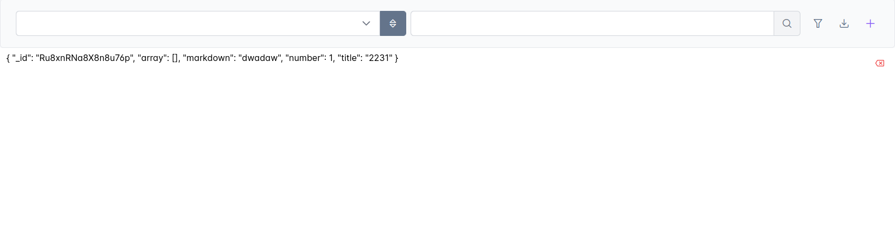

# janmp:sdui

SchemaDrivenUI is a Meteor Package containing some high level React components and setup functions, to build an api to feed those components with data.

# Components


## SdChat
SdChat is a UI component, that offers an interface for multi-user[^1] multi-session chats as well as single-user single-session chats (meant for use with a chat-bot).
In addition to a standard chat interface with support for [gravatar](https://gravatar.com) user icons and [markdown formatting](https://www.markdownguide.org) in chat-bubbles, it also provides a display bar for links to additional data.

- you can create a new chat component by using the `SdChat` component giving it the dataOptions object obtained by createChatAPI.


## SdChatLog

- this can be used to create a chat log. The log consists of a filterable table where each row corresponds to a chat session. When clicking on the row, a window opens that shows the chat history for that session.

## createChatBot

- this is a helper function that creates a chatbot (e.g. anthropic or openai)
- it makes the API call to the underlying LLM provider and handles the response stream
- you can also give it an a function that returns an array of tools that will be made available to the LLM.


## createChatAPI

- this function can be called to create the necessary backend methods and publications.
- its return `dataOptions` can be used as parameter for SdChat.


## createAppLayoutAPI

- This function can be used to create the layout for an app.
- For this, it receives an array of sources (react components) that will be made available to the user via a sidebar.
- Each source needs to specify a label (e.g. 'Home'), the path (e.g. '/home') an icon, which roles have access to the path the react component that will get rendered.
- Additionally, each source can have itself items that will become nested paths.
- note that the function only returns the `dataOptions` object.
- this object then needs to be passed to `SdAppLayout` to create the actual routes.


## createTableDataAPI

- this function creates the backend methods and publications for updating data in a specific table.
- it returns `dataOptions` that can be used as props in the UI components for displaying the data.
- most importantly, we need to pass the schema object based on which the components and methods will be built.
- we then also need to pass the MongoDB collection where we want to store the information and what the name of the source is.
- Besides those parameters, there are many other parameters that control the behavior of the created component.


- Example Usge. First a schema and a mongodb collection is created. Then we can create components based on that schema.
```coffee
sourceSchema = new Schema
  type: 'object'
  properties:
    markdown:
      title: 'Markdown'
      type: 'string'
      sdContent: isContent: true
      uniforms: -> null
    title:
      title: 'Titel'
      type: 'string'
    number:
      title: 'Eine Zahl'
      type: 'number'
    array:
      title: 'Personen'
      type: 'array'
      items:
        type: 'object'
        properties:
          name:
            title: 'Name'
            type: 'string'
          boolean:
            title: 'ist zu Allem bereit.'
            type: 'boolean'
        required: ['name']
    required: ['markdown', 'title', 'number', 'array']

ContentEditorTest = new Mongo.Collection 'content-editor-test'

dataOptions = createTableDataAPI
  sourceName: 'content-editor-test'
  sourceSchema: sourceSchema
  collection: ContentEditorTest
  canEdit: true
  canAdd: true
  canDelete: true
  canExport: true
  canSort: true
  canSearch: true

export ContentEditor = ->
    <SdContentEditor dataOptions={dataOptions} />

export Table = ->
    <SdContentEditor dataOptions={dataOptions} />

export List = ->
    <SdContentEditor dataOptions={dataOptions} />
```

- This will result in the following components on the frontend:
    - Content Editor: 
    - Table: 
    - List: 

## Schema Class

The `Schema` class is a wrapper around JSON Schema that provides validation and form generation capabilities via AJV and Uniforms. It includes several utility methods for schema manipulation:

### Methods

- **`addProperty(property)`**: Adds new properties to the schema while preserving the existing `required` array
- **`pick(keys)`**: Creates a new schema with only the specified property keys, filtering the `required` array to include only picked keys
- **`omit(keys)`**: Creates a new schema excluding the specified property keys, removing them from the `required` array
- **`withId()`**: Adds an `_id` property to the schema

All methods return a new Schema instance and maintain immutability by creating copies of the schema and required array.

### Required Fields Handling

As of the latest update, all schema manipulation methods properly handle the JSON Schema `required` array:
- When adding properties, the existing required fields are preserved
- When picking properties, only required fields that are also picked are kept
- When omitting properties, any required fields that are omitted are removed from the required array
- All operations maintain immutability and don't modify the original schema
